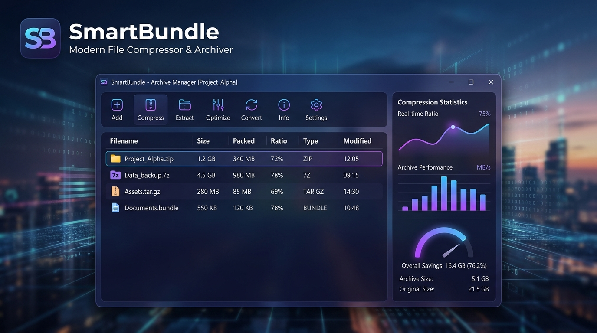

<div align="center">

# SmartBundle

**Archivador y suite de compresión de alto rendimiento para Windows**

[](https://github.com/marcelosf80/SmartBundle)
[](https://www.python.org/)
[](LICENSE)
[](https://github.com/marcelosf80/SmartBundle/releases/latest)

<br>



<br>

[Descargar Instalador](https://github.com/marcelosf80/SmartBundle/releases/latest) • [Informe de Rendimiento](BENCHMARK_REPORT.md) • [Instrucciones de Instalación](#instalación-y-despliegue) • [Uso por Consola (CLI)](#interfaz-de-línea-de-comandos-cli)

</div>

---

## Descripción General

**SmartBundle** es una herramienta de compresión y archivado desarrollada para ofrecer ratios de reducción superiores al estándar ZIP sin sacrificar velocidad en descompresión. El formato `.sb` implementa empaquetado por bloques sólidos, preprocesadores de código ejecutable x86/x64, filtros de transformación numérica y selección dinámica de algoritmos de compresión modernos (`Zstandard`, `Brotli`, `LZMA2` y `PPMd`).

Incluye un gestor visual interactivo (con visor de contenido, adición y eliminación de archivos en caliente), integración completa en el menú contextual de Windows y una utilidad de línea de comandos para automatización de scripts.

---

## Características Principales

* **Compresión Adaptativa Multimotor**: Analiza el tipo de flujo de datos y aplica el motor óptimo:
  * **Zstandard Ultra**: Descompresión en tiempo real a velocidades de bus (hasta 8+ MB/s en entornos típicos).
  * **Brotli Max**: Máxima densidad en estructuras de texto, JSON, código fuente y registros.
  * **LZMA2**: Alta tasa de reducción en binarios de gran volumen.
  * **PPMd**: Compresión de contexto finito para texto repetitivo y volcados de datos.
* **Preprocesadores de Bytecode**: Filtros BCJ integrados para normalizar saltos relativos en ejecutables x86/PE antes de comprimir.
* **Integridad Garantizada**: Comprobación continua mediante sumas de verificación CRC-32 por bloque y validación final SHA-256 en el pie del archivo.
* **Gestor de Archivos Visual**: Navegación interna por carpetas, previsualización de ficheros, adición progresiva y eliminación directa de entradas.
* **Integración con el Explorador de Windows**: Opciones en cascada en el menú contextual del sistema con accesos directos de compresión y extracción.

---

## Comparativa de Rendimiento

Pruebas ejecutadas sobre un conjunto de datos heterogéneo (39 archivos, incluyendo código Python, bases de datos JSON, volcados de servidor, binarios x86 y carpetas anidadas) con un peso original de **4.02 MB (4,020,963 bytes)**:

| Modo de Compresión | Tamaño Resultante | Reducción Obtenida | Velocidad de Extracción | Integridad Hash (SHA-256) |
| :--- | :---: | :---: | :---: | :---: |
| **Fast** (Zstd) | **73.4 KB** (0.07 MB) | **98.1%** | **8.0 MB/s** | Coincidencia Exacta (PASS) |
| **Balanced** (Heurístico) | **61.8 KB** (0.06 MB) | **98.4%** | **7.3 MB/s** | Coincidencia Exacta (PASS) |
| **Extreme** (SOTA) | **55.2 KB** (0.05 MB) | **98.6%** | **6.8 MB/s** | Coincidencia Exacta (PASS) |

> Para consultar la metodología técnica completa y las curvas de rendimiento, revisa el archivo [BENCHMARK_REPORT.md](BENCHMARK_REPORT.md).

---

## Instalación y Despliegue

### Opción A: Paquete Compilado para Windows (Recomendado)

1. Dirígete a la sección de [Releases](https://github.com/marcelosf80/SmartBundle/releases/latest) y descarga el archivo `SmartBundle-Windows.zip`.
2. Descomprime el contenido en una carpeta local.
3. Ejecuta `Instalar_SmartBundle_En_C.bat` (solicitará permisos de administrador para desplegarse en `C:\Program Files\SmartBundle`).
4. El instalador creará los accesos directos en el Escritorio y el Menú Inicio, y registrará las asociaciones del menú contextual.

### Opción B: Ejecución desde Código Fuente

#### Requisitos
- Windows 10 o superior (64-bit)
- Python 3.10 o superior

#### Instalación de dependencias
```bash
git clone https://github.com/marcelosf80/SmartBundle.git
cd SmartBundle
pip install -r requirements.txt
```

#### Lanzar la aplicación gráfica
```bash
python sb_gui.py
```

---

## Interfaz de Línea de Comandos (CLI)

SmartBundle dispone de una CLI (`sb_cli.py`) diseñada para pipelines de respaldo y scripts de mantenimiento:

### Comprimir archivos o directorios
```bash
# Compresión estándar
python sb_cli.py compress "C:\Ruta\Origen" -o "salida.sb"

# Compresión ultra extrema
python sb_cli.py compress "C:\Ruta\Origen" -o "salida.sb" -m extreme
```

### Descomprimir y verificar
```bash
python sb_cli.py decompress "archivo.sb" -o "C:\Ruta\Destino"
```

### Listar contenido del archivo
```bash
python sb_cli.py list "archivo.sb"
```

### Comprobación de integridad
```bash
python sb_cli.py test "archivo.sb"
```

---

## Estructura del Formato `.sb`

```
┌────────────────────────────────────────────────────────┐
│ Magic Header (SB01 - 4 bytes)                          │
├────────────────────────────────────────────────────────┤
│ Manifest Metadata & File Index (Brotli/Zstd)           │
├────────────────────────────────────────────────────────┤
│ Solid Payload Block 1 (Header + Payload + CRC32)       │
├────────────────────────────────────────────────────────┤
│ Solid Payload Block 2 (Header + Payload + CRC32)       │
├────────────────────────────────────────────────────────┤
│ ...                                                    │
├────────────────────────────────────────────────────────┤
│ Footer: Total Blocks Count (4 bytes)                   │
│ Footer: Solid Stream SHA-256 Digest (32 bytes)         │
│ Magic Footer (SB_END - 6 bytes)                        │
└────────────────────────────────────────────────────────┘
```

---

## Licencia

Distribuido bajo licencia MIT. Consulta el archivo `LICENSE` para más información.
